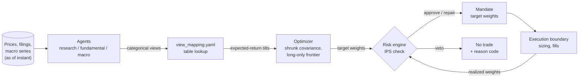

# agentic-portfolio-manager

[](https://github.com/FredTheMay/agentic-portfolio-manager/actions/workflows/ci.yml)
[](LICENSE)

A paper-trading portfolio manager. Language-model agents contribute qualitative research;
every number is computed in Python; a deterministic rules engine enforces an Investment
Policy Statement held in configuration.

> **Educational paper-trading simulation. Not investment advice.**
> There is no live broker endpoint.

Python · FastAPI · React · TypeScript · AWS CDK

627 tests · mypy --strict clean · 3 enforced import-boundary contracts · ≥90% coverage
gate on the risk/CFA core — see [Engineering rigor](#engineering-rigor).

---

## Quick start

Requires Python 3.12 or 3.13. No API keys are needed — the system runs offline against
recorded or synthetic data.

```bash
make install                            # virtualenv and dependencies
make check                              # tests, mypy --strict, import contracts, coverage
make serve                              # read-only API on :8000
cd web && npm install && npm run dev    # dashboard on :5173
```

To run against live market data, copy `.env.example` to `.env` and add credentials:

```bash
make check-keys    # verify each credential against its service
make backfill      # record ~3y of prices, filings and macro series
make results       # regenerate RESULTS.md
```

Two deployment options, same read-only architecture: a single EC2 instance
([deploy/README.md](deploy/README.md)) or serverless on AWS Lambda + DynamoDB + CloudFront
([infra/README.md](infra/README.md)).

## What it does

One decision cycle, on a schedule:

1. Read prices, SEC filings and macro series **as of** the decision instant.
2. Agents form categorical views; a configuration table converts them to expected-return
   tilts.
3. Estimate a shrunk covariance matrix and solve a long-only, position-capped frontier.
4. The risk engine approves, repairs, or vetoes the proposed weights against the IPS.
5. Emit a mandate of target weights across the execution boundary.
6. Reconcile realized weights against target and carry the drift into the next cycle.



The only place a model's opinion becomes a number is the table lookup — `validate_llm_schema`
rejects any LLM response schema that includes a numeric field before it can reach here.

## Layout

```
src/time/       Clock — the only module permitted to read the wall clock
src/cfa/        CFA Level I quantitative core. Pure functions, zero I/O.
src/data/       Events, point-in-time store, EDGAR/FRED/Alpaca clients, cache
src/risk/       IPS engine and reason codes
src/decision/   Optimizer and mandate emission
src/execution/  Sizing, fill models, brokers
src/agents/     Research, fundamental and macro agents; view aggregation
src/llm/        Provider abstraction, schema guard, caching and failover
src/backtest/   Event loop, walk-forward harness, performance metrics
src/api/        Read-only HTTP surface and per-symbol research
config/         IPS, universe, view mapping
proto/          The execution contract
web/            React + TypeScript dashboard
deploy/         nginx, systemd and provisioning for a single EC2 instance
infra/          AWS CDK: Lambda, EventBridge, DynamoDB, S3 + CloudFront
```

## Design

See [DESIGN.md](DESIGN.md) for the architecture and the reasoning behind it, and
[RESULTS.md](RESULTS.md) for backtest output.

Three points worth stating up front:

**Semi-strong market efficiency is assumed.** The objective is risk-adjusted construction
under explicit constraints, not alpha generation.

**Time-weighted return is the headline metric**, because GIPS requires it: chain-linking
sub-period returns removes the effect of cash-flow timing. Money-weighted return is
reported alongside, and the gap between them is that effect.

**Alpha is always reported with its t-statistic.** A positive point estimate says nothing
on its own about whether it differs from zero.

## Known limitation: survivorship bias

The universe in [config/universe.yaml](config/universe.yaml) is a fixed, current list of
instruments rather than point-in-time index membership. Names that were delisted or
acquired never enter the sample, so the strategy is never charged for having held them.
**Absolute returns are overstated and should be read as an upper bound.**

Point-in-time constituent history is commercial data. Relative figures against the SPY/AGG
benchmark are less distorted, since the benchmark carries the same bias in the same
direction; constraint counts, turnover and implementation shortfall are unaffected.

## Engineering rigor

- **627 tests**, run offline with no network and no credentials — every client takes its
  fetcher by injection.
- **`mypy --strict`**, clean across the whole `src/` tree, including `disallow_any_unimported`.
- **Three architectural boundaries enforced by [import-linter](https://import-linter.readthedocs.io/)**,
  not convention: the decision layer cannot import execution, and the CFA and risk layers
  cannot import the LLM, execution, data or API layers. A violation fails the build.
- **A coverage gate**, not just a report: `make coverage-gate` fails CI below 90% on
  `src/cfa` and `src/risk` specifically — the two packages where a silent arithmetic error
  would propagate into every downstream number.
- **Golden tests compute the expected value by hand**, in a comment, rather than asserting
  against the implementation's own output — the risk property test re-derives its
  constraints the same way, for the same reason.
- **A schema guard, not a prompt instruction**, keeps the LLM categorical: any response
  schema with a numeric field is rejected before a request is ever sent, and the full
  decision cycle is tested end-to-end against a `NullProvider` that always answers NEUTRAL.

All of the above runs in [CI](.github/workflows/ci.yml) on every push and pull request.

## Contributing

See [CONTRIBUTING.md](CONTRIBUTING.md).
